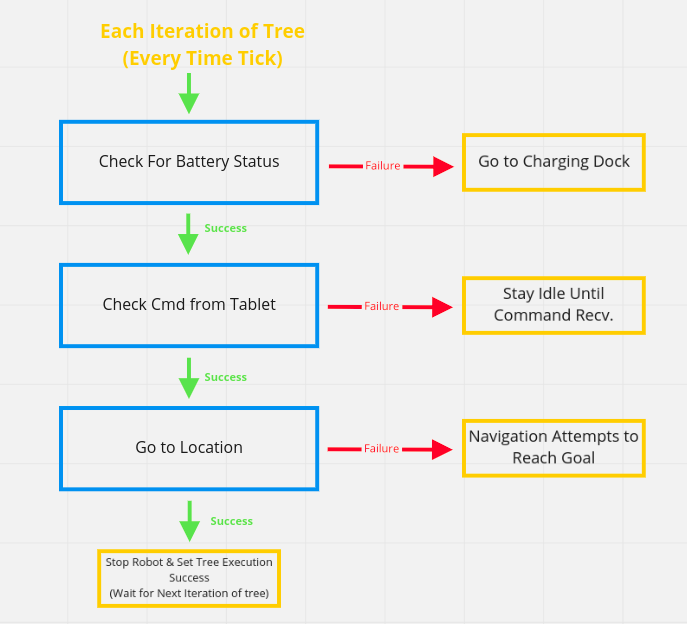
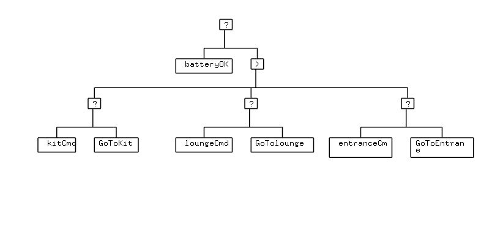
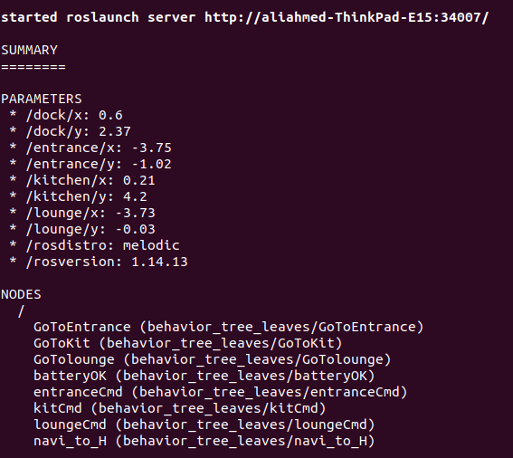
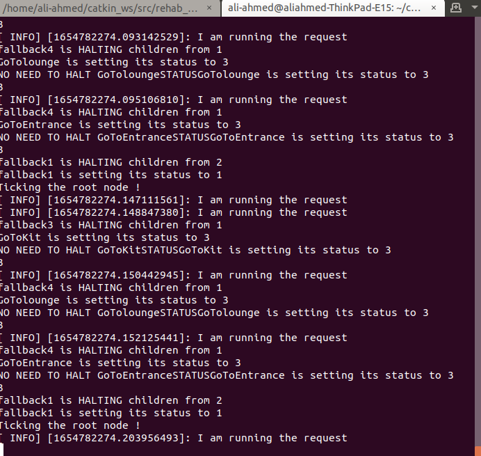

  
# Rehab Robot Behavior Tree Based Navigation & Integration with Android Tablet


## Overview
This package contains the behavior tree based Rehab robot control framework. The baseline of this implementation can be found [here](https://github.com/miccol/ROS-Behavior-Tree.git). Reading material can be seen in this [document](/home/ali-ahmed/catkin_ws/src/rehab_bt/BTUserManual.pdf) for basics of Behavior trees. The aim to develop behavior tree based framework is to enable the robot perform different actions and to respond to user commands. The interconnection of mobile tablet on the robot with ROS will enable 


As a first implementation, a basic scenerio is implemented in this repository. A basic block diagram of overall system is shown below:


In this repository, a basic demo has been implementated. Two basic actions (battery check & Go to a location) have been implemented and tested on actual robot. A basic flow chart of the tree and the tree diagram (in terms of behavior diagram) has been shown below. 







## Pre-Requisites

1. This package is tested with ROS Melodic so preferably use the package with same ROS version.
2. This package depends highly on the navigation stack & all the nessasry bring up nodes requuired to fully power up the robot. The complete instruction to power up and to run the navgiation can be found [here](https://github.com/Xavorcorp/Rehabbot-EETeam.git).


## Setup 

After following the step 2 in the pre-requisites, you must have the following in working:

* Robot must be running navigation. Verify that the navigation stack is running & the robot is able to navigate by accepting goal from *RVIZ*. 


## Usage 
After following the above setup process, run the following nodes: 

1. Run the following launch file which will launch all the tree nodes and relevant rosparameters. This launch file accepts a parameter ```using_sim``` which must be set to ```false``` when testing on actual robot. For testing the whole behavior tree framework with simulation, this parameter must be set to true. In this scope, only testing with the actual robot has been discussed. 

   ```bash 
   roslaunch behavior_tree_leaves rehab_robot_demo2.launch using_sim:=false
   ``` 
   You must see the rosparameters and the running ros nodes in the terminal as shown below in the image. 

   


2. Run the following to run the main node, 
   
   ```bash 
   rosrun behavior_tree_core demo2_method2 
   ```
   This node will run the tree algorithm and check for all the tree nodes that are running and will execute the behavior accordingly. You must see the status of different nodes printed on the terminal. This shows that the node is running error free.See the image below for reference. 
   
   
   

   


___
<br></br>

## Contact
**Author:** Ali Ahmad  <br/>
**Designation:** Senior Robotics Engineer <br/>
**Email:** ali.ahmad@xavor.com <br/>