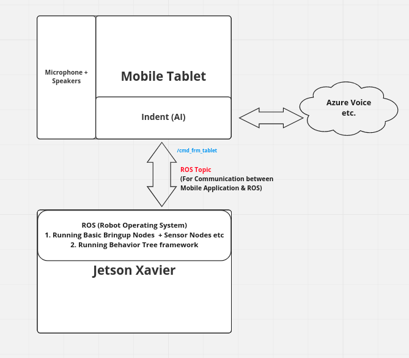
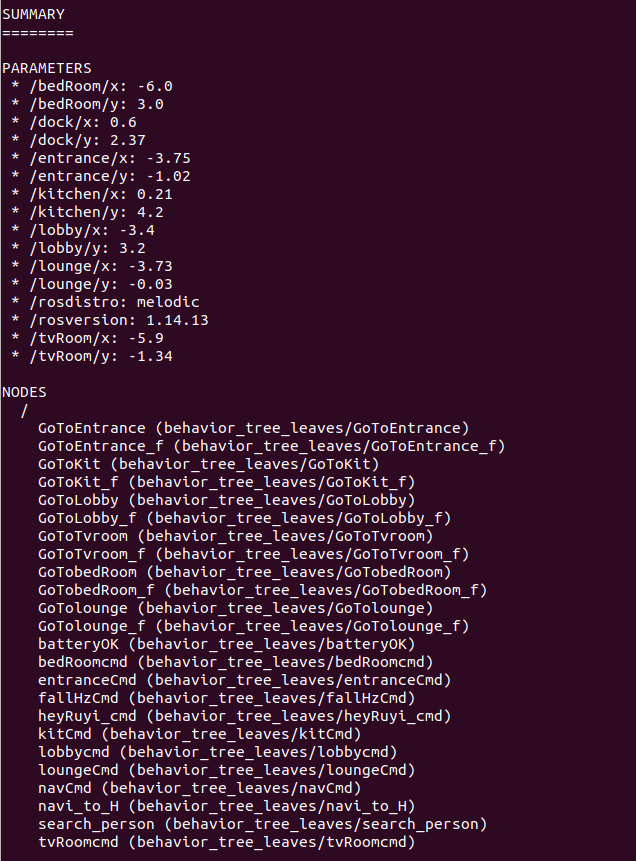
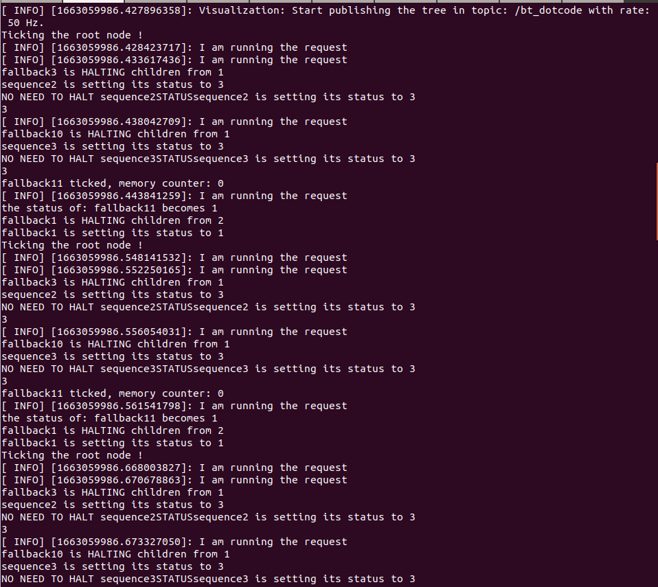

  
# Rehab Robot Behavior Tree Based Navigation & Integration with Android Tablet


## Overview
This package contains the behavior tree based Rehab robot control framework. The baseline of this implementation can be found [here](https://github.com/miccol/ROS-Behavior-Tree.git). The aim to develop behavior tree based framework is to enable the robot perform different actions and to respond to user commands. The interconnection of mobile tablet on the robot with ROS will enable user given voice commands to trigger the actions on the robot.


As a first implementation, a basic "Hello" scenerio has been implemented in this repository. A basic block diagram of overall system is shown below which shows the different system blocks and their interconnection:




In this repository, a behavior tree implementation has been done. There are majorly three behaviors implemented which include battery failure fallback, Goto command, fall hazard behavior and a hello response behavior. An overall tree connection along with individual trees are shown below in images. 


## Hello Scenerio 

### Pre-Requisites

1. This package is tested with ROS Melodic so preferably use the package with same ROS version.
2. This package depends highly on the navigation stack & all the nessasry bring up nodes requuired to fully power up the robot. The complete instruction to power up and to run the navgiation can be found [here](https://github.com/Xavorcorp/Rehabbot-EETeam.git).
3. The person tracking model should be up and running. The intructions are availble [here](https://github.com/zeeshan-sardar/ros_ai_integration).
4. The ROS node ```rehab_person_loc``` must be up and publishing the person location in MAP frame on specified ROS topic ```person_loc_estimated```. The instructions to run the node can be found [here](https://github.com/aliahmadXVR/rehab_person_loc).
5. Mobile app for Care Companion must installed in the robot. 


### Setup 

After following the step 2 in the pre-requisites, you must have the following in working:

* Robot must be running navigation. Verify that the navigation stack is running & the robot is able to navigate by accepting goal from *RVIZ*. 

* AI model must be returning the person position on ```person_loc``` ROS topic.

* ```rehab_person_loc``` must be returning the person positon in MAP frame on ```person_loc_estimated``` ROS topic.

* Mobile app must be running and publishing commands on the ROS topic ```cmd_frm_tablet```.


### Usage 
After following the above setup process, run the following nodes: 

1. Run the following launch file which will launch all the tree nodes and relevant rosparameters. This launch file accepts a parameter ```using_sim``` which must be set to ```false``` when testing on actual robot. For testing the whole behavior tree framework with simulation, this parameter must be set to true. In this scope, only testing with the actual robot has been discussed. 

   ```bash 
   roslaunch behavior_tree_leaves rehab_robot_demo2.launch using_sim:=false
   ``` 
   You must see the rosparameters and the running ros nodes in the terminal as shown below in the image. 

   


2. Run the following to run the main node, 
   
   ```bash 
   rosrun behavior_tree_core demo2_method2 
   ```
   This node will run the tree algorithm and check for all the tree nodes that are running and will execute the behavior accordingly. You must see the status of different nodes printed on the terminal. This shows that the node is running error free.See the image below for reference. 
   
   

3. After the step 2, the Behavior tree nodes are up and running. Now the CUI inputs are required to trigger the respective behaviors. Currently in this scope only the "Hello Scenerio" is discussed. 
4. To trigger the hello scenerio, press the Microphone enable button and Say "Hey Ruyi Or Hello Ruyi". The Hello behavior will be triggered and the robot will start rotating untill it finds the person standing in front of it. The robot will stop rotating when it will find the person and will move within 6 feet vicinity of the person.  

## Under-Development Work 

In the main tree diagram above, the battery fallback, navigation command and the fall hazard tree have been shown. They have been individually tested on the actual robot but are still under development. They are not yet connected to the CUI.

___
<br></br>

## Contact
**Author:** Ali Ahmad  <br/>
**Designation:** Senior Robotics Engineer <br/>
**Email:** ali.ahmad@xavor.com <br/>